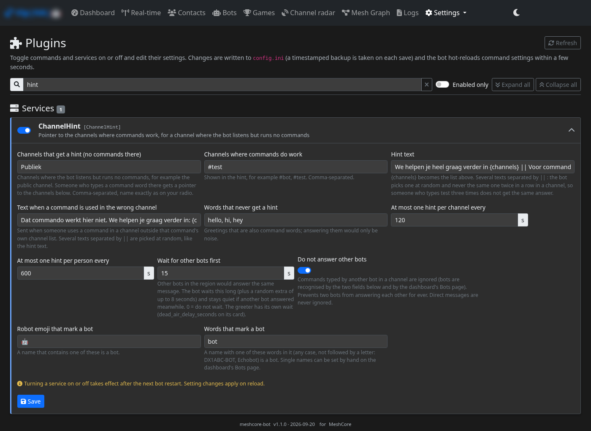
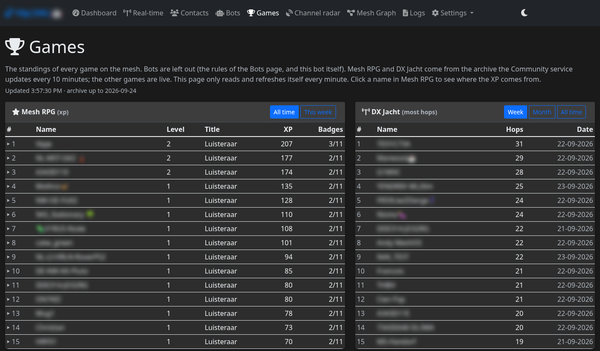
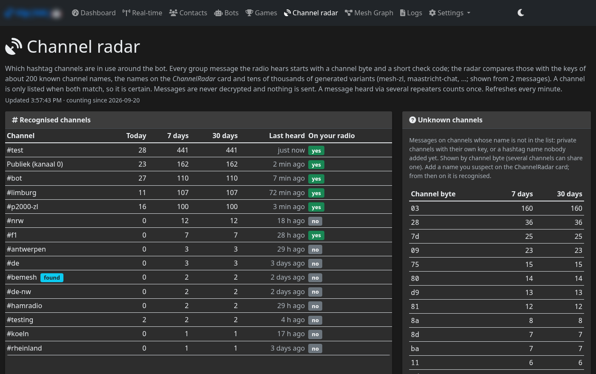

# MeshCore bot for Home Assistant

*[Nederlands](README.nl.md)*

> **Based on [agessaman/meshcore-bot](https://github.com/agessaman/meshcore-bot)** by Adam Gessaman and others (MIT).
> This repository turns it into Home Assistant add-ons and adds its own commands, games and a Home Assistant layer.
> It is not an official part of that project; see [Thanks](#thanks).

Home Assistant add-ons for a MeshCore mesh: a **bot** with more than 80 commands (weather, traffic, public transport,
emergency numbers, games, F1, ...) and a **proxy** so the bot and the [meshcore-ha](https://github.com/meshcore-dev/meshcore-ha)
integration can share the same USB radio. Many extra commands use Dutch and Belgian open data; the bot answers in
Dutch, English, German or French.

| Add-on | What it does |
|---|---|
| [MeshCore Proxy](meshcore-proxy/) | Shares one USB radio over TCP, so meshcore-ha and the bot can use it at the same time. |
| [MeshCore Bot](meshcore-bot/) | [agessaman/meshcore-bot](https://github.com/agessaman/meshcore-bot) as an add-on: all settings in Home Assistant and on the dashboard, a dashboard in the HA sidebar, room server, webhook, notifications and many extra commands and games. |

```
                    ┌──────────────┐
  USB radio ──────► │ MeshCore     │ ◄────── meshcore-ha (integration, optional)
                    │ Proxy :5010  │ ◄────── MeshCore Bot (add-on)
                    └──────────────┘
```

## What you need

- **Home Assistant OS or Supervised** (add-ons need the Supervisor).
- **A MeshCore radio with the companion (USB) firmware**, plugged into the machine that runs Home Assistant, with an
  antenna for your band (868 MHz in Europe). For example the
  [Seeed XIAO ESP32S3 + Wio-SX1262](https://www.seeedstudio.com/XIAO-ESP32S3-for-Meshtastic-LoRa-with-3D-Printed-Enclosure-p-6314.html)
  with firmware from the [MeshCore project](https://github.com/meshcore-dev/MeshCore).
- **Optional**, for extra functions (off by default, switched on per part on the dashboard's *Plugins* page):
  [meshcore-ha](https://github.com/meshcore-dev/meshcore-ha) (status of your repeater, `rptr`),
  the HACS integration *f1_sensor* (the F1 channel and prediction game), your own room server (notifications and chat).

## Installation in short

Click the button to add this repository to your Home Assistant, or follow step 1:

[](https://my.home-assistant.io/redirect/supervisor_add_addon_repository/?repository_url=https%3A%2F%2Fgithub.com%2Fvipje%2FMeshcore-bot-for-Home-Assistant)

1. In Home Assistant: **Settings → Add-ons → Add-on Store → ⋮ → Repositories**, add
   `https://github.com/vipje/Meshcore-bot-for-Home-Assistant`.
2. Install **MeshCore Proxy**, choose your radio under *Serial port* and start it.
3. Install **MeshCore Bot**, fill in at least the bot name, the channels and your own *Admin public key*, and start it.
4. Open the dashboard in the HA sidebar and switch on what you want on the *Plugins* page.

**Step by step, with explanations: [INSTALL.md](INSTALL.md).** All options are in the **Documentation** tab of each add-on.

## Screenshots

*Plugins*: one card per command and service (here the public-channel hint)



*Games*: all standings, bots left out (names blurred here)



*Channel radar*: which hashtag channels are active around the bot



## Sharing the mesh with other bots

A mesh is shared airtime. When several bots serve the same region, they should not drown out the people or each other.
This add-on is built for that:

- **Recognisable.** The bot name always ends in `|🤖` (`MeshCore` becomes `MeshCore|🤖`), so everyone sees a message comes from a bot.
- **Recognises other bots** by the robot emoji or the word "bot" in their name (`Name|🤖`, `DX1ABC-BOT`, `Echobot`;
  `Botond` or `Abbott` stay people). You can also mark names by hand on the dashboard's *Bots* page.
- **Never answers another bot.** Commands typed by another bot in a channel are ignored, so two bots cannot keep
  answering each other. The greeter never greets bots, and bots are left out of all rankings and games.
- **Leaves the public channel to people.** You can make a busy channel a "hint channel" (card *ChannelHint*): commands do
  not run there. Someone who types a command gets a short pointer to your bot channels. The bot first waits 15 to 23
  seconds and says nothing if another bot has already reacted.
- **Answers at most once every 4 seconds** in total, and splits long answers with a pause.

What it does **not** do: when two bots listen on the same command channel, both answer. So before you start, ask in your
region which channels are already served by a bot, and give your bot its own channels (for example `#bot`, `#test`) or
agree with the other owner who answers where.

## Commands

The full list of commands is in **[COMMANDS.md](COMMANDS.md)** (in Dutch). On the mesh you can also type `help`: the bot
sends the link to that list, and `help <command>` explains one command.

## Thanks

This project builds on the work of others:

- **[agessaman/meshcore-bot](https://github.com/agessaman/meshcore-bot)** by Adam Gessaman and others (MIT): the bot itself,
  with its commands, dashboard and all settings (`config.ini.example`). This add-on uses a fixed version (v1.1.0) and adapts
  it at build time with small, documented patches (`meshcore-bot/local_patches/`). Questions about the bot itself belong
  there; questions about these add-ons here.
- **[MeshCore](https://github.com/meshcore-dev/MeshCore)**: the firmware and protocol of the mesh network, and the Python
  libraries [meshcore_py](https://github.com/meshcore-dev/meshcore_py) and
  [meshcore-cli](https://github.com/meshcore-dev/meshcore-cli) the bot uses to talk to the radio.
- **[meshcore-ha](https://github.com/meshcore-dev/meshcore-ha)** and **[MeshCore Chat](https://github.com/mwolter805/meshcore-ha-chat)**:
  the Home Assistant integration and chat panel these add-ons work with.
- **Open data** for the extra commands: RDW (licence plates), NDW (traffic jams and road works), OVapi (public transport),
  KNMI (weather warnings, earthquakes), Rijkswaterstaat (water levels), CBS (fuel prices), EnergyZero (electricity price),
  Buienradar (rain), OpenStreetMap / Overpass (AEDs, charging points), Safecast (radiation), Nager.Date (public holidays),
  Open Trivia DB (quiz) and Storingradar (outages).

Licence: MIT, see [LICENSE](LICENSE). The original bot has its own MIT licence.
